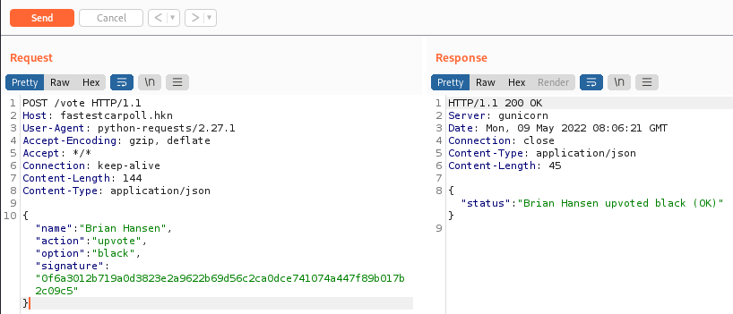

# Dakkedak på Repeat
### Description
>Store fælge, billige dæk, _straight pipe_ udstødning med _blowoff_ og papegøjeplader, så der også er plads til et anlæg... Nogle ting står bare ikke til diskussion. Det er straks sværere at afgøre Årets Hurtigste Bil 2022.
>
>Selvom der er rigeligt med aktivitet har afstemningen på [http://fastestcarpoll.hkn](http://fastestcarpoll.hkn) i hvert fald ingen klar vinder endnu.
>
>For at sikre en høj integritet, tjekker API'en, at stemmerne har en valid digital signatur - men alle deltagerne skriver jo under med navnet Brian..? Kan du måske få afgjort afstemningen med, lad os sige, mindst 50% af alle stemmer til din foretrukne vinder?

Vi får udleveret filen `trace.zip` og ved fra overstående tekst at vi skal kigge på navnene og signaturen.

## Løsning
Hvis vi starter med at kigge i `trace.zip` kan vi se at vi har en `pcapng` fil. Ved at kigge lidt nærmere på TCP streamen kan vi se at vi har en helt masse traffik til at vote på en bil til en poll. Ved at kigge på de forskellige POST requests kan vi se at alle har navnet Brian. Med denne information havde jeg en fornemmelse om at signaturen nok var den samme hvis de havde samme navn og stemte på den samme bil. 

Hvis vi sammenligner TCP stream 5 og 6 kan vi se at de er præcis den samme!
>POST /vote HTTP/1.1
>Host: fastestcarpoll.hkn
>User-Agent: python-requests/2.27.1
>Accept-Encoding: gzip, deflate
>Accept: */*
>Connection: keep-alive
>Content-Length: 144
>Content-Type: application/json
>{"name": "Brian Hansen", "action": "upvote", "option": "black", "signature": "0f6a3012b719a0d3823e2a9622b69d56c2ca0dce741074a447f89b017b2c09c5"}

Nu har vi en valid request vi kan sende til serveren for at manipulere resultaterne!

Vi kan nu opfange en request til siden i burpsuite og sende den til Repeat modulet.

Og vi kan se at requesten virker! Hvis vi kigger på hjemmesiden kan vi også se at stemmeprocenten for sort er gået op!

Vi kan bare blive ved med at sende denne request indtil at farven har 50% stemmer og vi blive mødt med konfetti og flaget:

Og der har vi flaget!
>DDC{4_Br14n_bY_4Ny_o7h3R_n4m3}

*Der er sikkert en bedre måde at gøre det på men et flag er et flag :)*